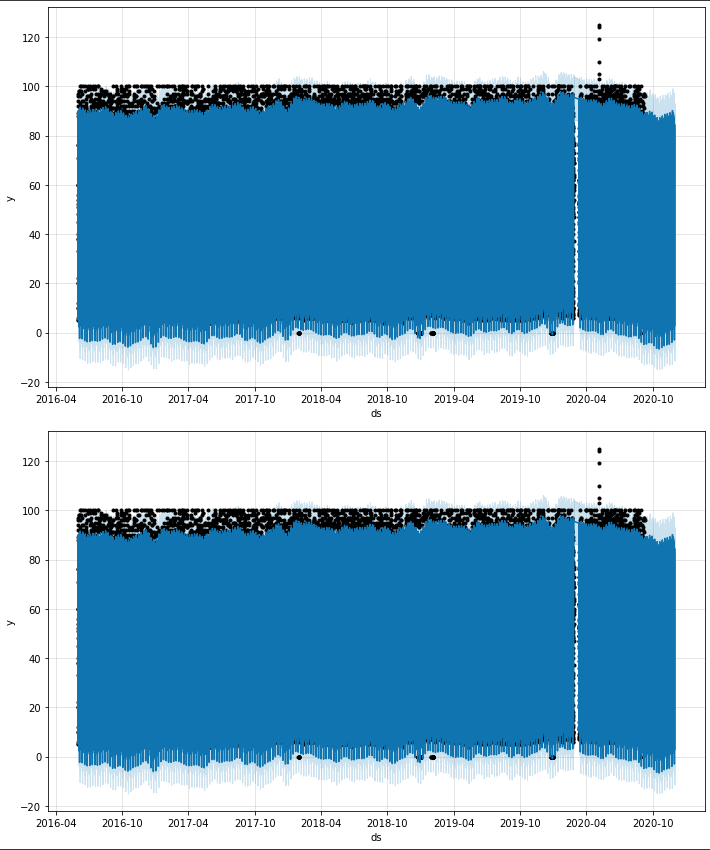
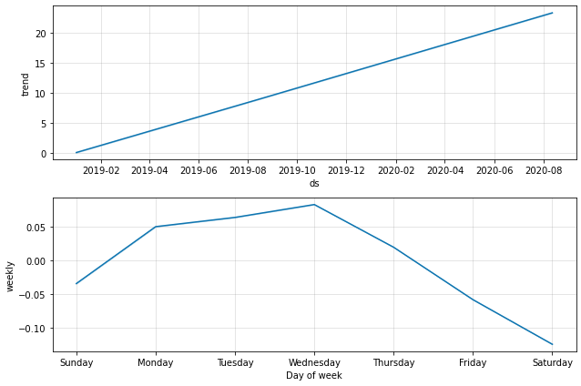

# Prophet Forecasting for MercadoLibre

## Table of Contents


1. [Part One: Find unusual patterns in hourly Google search traffic](#part-one-find-unusual-patterns-in-hourly-google-search-traffic)

2. [Part Two: Mine the search traffic data for seasonality](#part-two-mine-the-search-traffic-data-for-seasonality)

3. [Part Three: Relate the search traffic to stock price patterns](#part-three-relate-the-search-traffic-to-stock-price-patterns)

4. [Part Four: Create a time series model by using Prophet](#part-four-create-a-time-series-model-by-using-prophet)

5. [Part Five (Optional): Forecast the revenue by using time series models](#part-five-optional-forecast-the-revenue-by-using-time-series-models)

6. [Results](#results)

## Part One: Find Unusual Patterns in Hourly Google Search Traffic

- [x] Read the search data into a DataFrame, and then slice the data to just the month of May 2020. 
   - During this month, MercadoLibre released its quarterly financial results. 
   - Use hvPlot to visualize the results. 
   - Do any unusual patterns exist? 
      - **Answer:** Yes
   - Did the Google search traffic increase during the month that MercadoLibre released its financial results?
      - **Answer:** Yes, the median traffic search increased.
```python
# Store data in dataframe
df_mercado_trends = pd.read_csv('google_hourly_search_trends.csv', index_col="Date", parse_dates=True)

# Slice the DataFrame to just the month of May 2020
df_may_2020 = df_mercado_trends.loc["2020-05"]

# Use hvPlot to visualize the data for May 2020
df_may_2020.hvplot(title="Search trends MercadoLibre May 2020")

# Calculate the sum of the total search traffic for May 2020
traffic_may_2020 = df_may_2020.loc["2020-05"].sum()

# Calcluate the monhtly median search traffic across all months 
# Group the DataFrame by index year and then index month, chain the sum and then the median functions
median_monthly_traffic = df_mercado_trends["Search Trends"].groupby(by=[df_mercado_trends.index.year, df_mercado_trends.index.month]).median()
```

   
   
## Part Two: Mine the Search Traffic Data for Seasonality

- [x] Group the hourly search data to plot the average traffic by the day of the week for example, Monday vs. Friday.

```python
# Group the hourly search data to plot (use hvPlot) the average traffic by the day of week 
group_level_weeks = df_mercado_trends.index.dayofweek
df_mercado_trends.groupby(group_level_weeks).mean().hvplot(title = "Average Google search traffic grouped by day of week")
```

- [x] Using hvPlot, visualize this traffic as a heatmap, referencing `index.hour` for the x-axis and `index.dayofweek` for the y-axis. 
   - Does any day-of-week effect that you observe concentrate in just a few hours of that day? 
      - **Answer:** Yes

```python
# Use hvPlot to visualize the hour of the day and day of week search traffic as a heatmap.
weekly_trends = df_mercado_trends.index.dayofweek
df_mercado_trends.groupby(weekly_trends).mean().hvplot()

df_mercado_trends.hvplot.heatmap(
    x='index.hour',
    y='index.dayofweek',
    C='Search Trends',
    cmap='reds',
    title= "Average search traffic during Hour of the day grouped by Days of the week"
).aggregate(function=np.mean)
```


- [x] Group the search data by the week of the year. 
   - Does the search traffic tend to increase during the winter holiday period (weeks 40 through 52)? 
      - **Answer:** Yes, Traffic increase during the winter holiday period.

```python
# Group the hourly search data to plot (use hvPlot) the average traffic by the week of the year
group_level_week_num = df_mercado_trends.index.isocalendar().week
df_mercado_trends.groupby(group_level_week_num).mean().hvplot(title="Average search traffic grouped by Week of the year")
```


## Part Three: Relate the Search Traffic to Stock Price Patterns

- [x] Read in and plot the stock price data. 
   - Concatenate the stock price data to the search data in a single DataFrame

```python
# Store data in dataframe
df_mercado_stock = pd.read_csv("mercado_stock_price.csv", index_col="date", parse_dates=True)
df_mercado_stock.index = pd.to_datetime(df_mercado_stock.index, infer_datetime_format = True)

# Concatenate the df_mercado_stock DataFrame with the df_mercado_trends DataFrame
# Concatenate the DataFrame by columns (axis=1), and drop and rows with only one column of data
mercado_stock_trends_df = pd.concat([df_mercado_trends, df_mercado_stock], axis=1).dropna()
```

- [x] Slice the data to just the first half of 2020, `2020-01` to `2020-06` in the DataFrame, and then use hvPlot to plot the data. 
   - Do both time series indicate a common trend that’s consistent with this narrative?
      - **Answer:** Yes, there is a trend consisent with the narative. Market events emerged during the year of 2020 that many companies found difficult. But, after the initial shock to global financial markets, new customers and revenue increased for e-commerce platforms.

```python
# For the combined dataframe, slice to just the first half of 2020 (2020-01 through 2020-06) 
first_half_2020 = mercado_stock_trends_df.loc["2020-01":"2020-06"]

# Use hvPlot to visualize the close and Search Trends data
# Plot each column on a separate axes
first_half_2020.hvplot(shared_axes=False, subplots=True).cols(1)
```


- [x] Create a new column in the DataFrame named “Lagged Search Trends” that offsets, or shifts, the search traffic by one hour. 

```python
# This column should shift the Search Trends information by one hour
mercado_stock_trends_df['Lagged Search Trends'] = mercado_stock_trends_df['Search Trends'].shift(periods=1)
```

- [x] “Stock Volatility”, which holds an exponentially weighted four-hour rolling average of the company’s stock volatility

```python
# This column should calculate the standard deviation of the closing stock price return data over a 4 period rolling window
mercado_stock_trends_df['Stock Volatility'] = mercado_stock_trends_df['close'].pct_change().rolling(4).std()
```

- [x] “Hourly Stock Return”, which holds the percentage of change in the company stock price on an hourly basis

```python
# This column should calculate hourly return percentage of the closing price
mercado_stock_trends_df['Hourly Stock Return'] = mercado_stock_trends_df['close'].pct_change()
```

- [x] Review the time series correlation, and then answer the following question: 
   - Does a predictable relationship exist between the lagged search traffic and the stock volatility or between the lagged search traffic and the stock price returns?
      - **Answer:** The lagged search traffic has a negative correlation with stock volatility, but it has positive correlation with hourly stock returns.


## Part Four: Create a Time Series Model by Using Prophet

- Set up the Google search data for a Prophet forecasting model.
   - After estimating the model, plot the forecast. 
   
```python
# Using the df_mercado_trends DataFrame, reset the index so the date information is no longer the index
mercado_prophet_df = df_mercado_trends.sort_index()
mercado_prophet_df = df_mercado_trends.reset_index()

# Label the columns ds and y so that the syntax is recognized by Prophet
mercado_prophet_df.columns = ["ds", "y"]

# Drop an NaN values from the prophet_df DataFrame
mercado_prophet_df = mercado_prophet_df.dropna()

# Call the Prophet function, store as an object
model_mercado_trend = Prophet()

# Fit the time-series model.
model_mercado_trend.fit(mercado_prophet_df)

# Create a future dataframe to hold predictions
# Make the prediction go out as far as 2000 hours (approx 80 days)
future_mercado_trends = model_mercado_trend.make_future_dataframe(periods=2000, freq="H")

# Make the predictions for the trend data using the future_mercado_trends DataFrame
forecast_mercado_trends = model_mercado_trend.predict(future_mercado_trends)

# Plot the Prophet predictions for the Mercado trends data
model_mercado_trend.plot(forecast_mercado_trends)
```

- How's the near-term forecast for the popularity of MercadoLibre?
   - **Answer:** According to the prediction the near-term forecast popularity is decreasing



- [x] Plot the individual time series components of the model to answer the following questions:

   - What time of day exhibits the greatest popularity?
      - **Answer:** 00:00 Midnight

   - Which day of the week gets the most search traffic?
      - **Answer:** # Tuesday

   - What's the lowest point for search traffic in the calendar year?
      - **Answer:** October - November

```python
# Set the index in the forecast_mercado_trends DataFrame to the ds datetime column
forecast_mercado_trends = forecast_mercado_trends.set_index("ds")

# From the forecast_mercado_trends DataFrame, use hvPlot to visualize
#  the yhat, yhat_lower, and yhat_upper columns over the last 2000 hours 
forecast_mercado_trends[["yhat", "yhat_lower", "yhat_upper"]].iloc[-2000:,:].hvplot()

# Reset the index in the forecast_mercado_trends DataFrame
forecast_mercado_trends = forecast_mercado_trends.reset_index()

# Use the plot_components function to visualize the forecast results 
# for the forecast_mercado DataFrame 
figures_mercado_trends = model_mercado_trend.plot_components(forecast_mercado_trends)
```
   

## Part Five (Optional): Forecast the Revenue by Using Time Series Models

- [x] Read in the daily historical sales that revenue figures, and then apply a Prophet model to the data.

```python
# Create dataframe
df_mercado_sales = pd.read_csv("mercado_daily_revenue.csv", index_col = "date", infer_datetime_format=True, parse_dates= True).dropna()

# Using the df_mercado_trends DataFrame, reset the index so the date information is no longer the index
df_mercado_sales = df_mercado_sales.sort_index()
df_mercado_sales = df_mercado_sales.reset_index()

# Label the columns ds and y so that the syntax is recognized by Prophet
df_mercado_sales.columns = ["ds", "y"]

# Drop an NaN values from the prophet_df DataFrame
df_mercado_sales = df_mercado_sales.dropna()

# Create the model
mercado_sales_prophet_model = Prophet(yearly_seasonality = True)

# Fit the model
mercado_sales_prophet_model.fit(df_mercado_sales)

# Predict sales for 90 days (1 quarter) out into the future.

# Start by making a future dataframe
mercado_sales_prophet_future = mercado_sales_prophet_model.make_future_dataframe(periods=90, freq="D")

# Make predictions for the sales each day over the next quarter
mercado_sales_prophet_forecast = mercado_sales_prophet_model.predict(mercado_sales_prophet_future)

```

- Interpret the model output to identify any seasonal patterns in the company revenue.       
   - For example, what are the peak revenue days?
      - **Answer:** Mondays - Wednesdays

```python
# Use the plot_components function to analyze seasonal patterns in the company's revenue
figures_mercado_sales = mercado_sales_prophet_model.plot_components(mercado_sales_prophet_forecast)

```



- [x] Produce a sales forecast for the finance group. 
   - Give them a number for the expected total sales in the next quarter. 
   - Include the best- and worst-case scenarios to help them make better plans.
      - **Answer:** The most likely total sales forecast for next quater for the period 2020-07-01 to 2020-09-30 is `4975`. The Best Case total sales forecast is `5925`. The Worst Case total sales forecast is `4019`.

```python
# Plot the predictions for the Mercado sales
mercado_sales_prophet_model.plot(mercado_sales_prophet_forecast)

# For the mercado_sales_prophet_forecast DataFrame, set the ds column as the DataFrame Index
mercado_sales_prophet_forecast = mercado_sales_prophet_forecast.set_index("ds")

# Produce a sales forecast for the finance division
# giving them a number for expected total sales next quarter.
# Provide best case (yhat_upper), worst case (yhat_lower), and most likely (yhat) scenarios.
mercado_sales_prophet_forecast = mercado_sales_prophet_forecast[["yhat", "yhat_upper", "yhat_lower"]]

# Create a forecast_quarter Dataframe for the period 2020-07-01 to 2020-09-30
# The DataFrame should include the columns yhat_upper, yhat_lower, and yhat
mercado_sales_forecast_quarter = mercado_sales_prophet_forecast.loc["2020-07-01":"2020-09-30"]

# Update the column names for the forecast_quarter DataFrame 
# to match what the finance division is looking for 
mercado_sales_forecast_quarter = mercado_sales_forecast_quarter.rename(columns= {"yhat": "Mostly likely", "yhat_upper": "Best Case", "yhat_lower": "Worst Case"})

# Displayed the summed values for all the rows in the forecast_quarter DataFrame
mercado_sales_forecast_quarter.sum()

```


## Results

**Results:** [Forecasting Analysis](./mercado_libre_forecast.ipynb)

**Resources:** [Resources](./Resources/)


## Final Outcome

You’ll gain proficiency in the following tasks:

- Identifying patterns in time series data.

- Mining for patterns in seasonality by using visualizations.

- Building sales-forecast and user-interest predictive models.