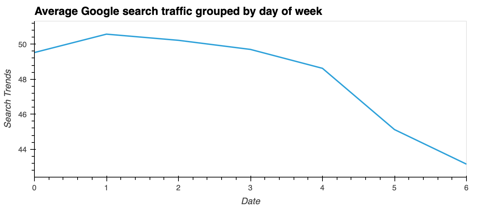
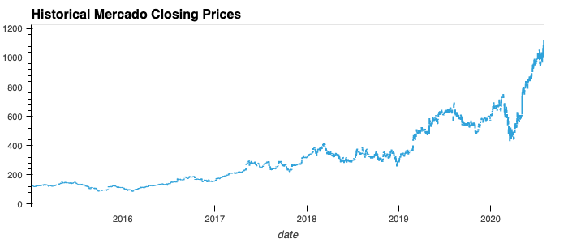
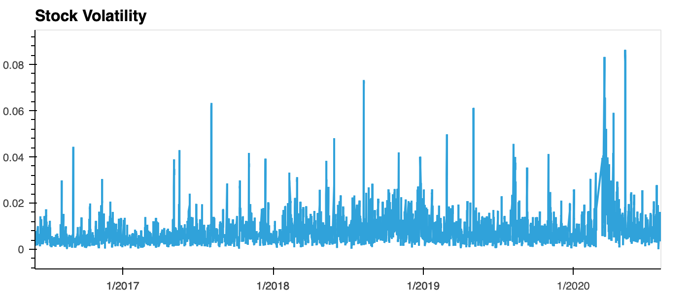
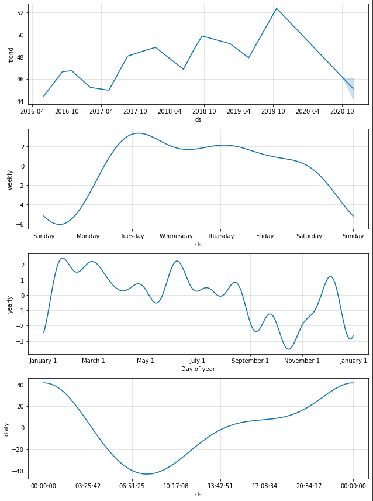

# Forecasting MercadoLibre using Prophet

## Table of Contents

1. Find unusual patterns in hourly Google search traffic.

2. Mine the search traffic data for seasonality.

3. Relate the search traffic to stock price patterns.

4. Create a time series model by using Prophet.

5. Forecast the revenue by using time series models.

6. Results

## Background

You’re a growth analyst at [MercadoLibre](http://investor.mercadolibre.com/investor-relations). With over 200 million users, MercadoLibre is the most popular e-commerce site in Latin America. You've been tasked with analyzing the company's financial and user data in clever ways to help the company grow. So, you want to find out if the ability to predict search traffic can translate into the ability to successfully trade the stock.

You’ll gain proficiency in the following tasks:

- Identifying patterns in time series data.

- Mining for patterns in seasonality by using visualizations.

- Building sales-forecast and user-interest predictive models.

## Part 1: Find Unusual Patterns in Hourly Google Search Traffic

- [x] Read the search data into a DataFrame, and then slice the data to just the month of May 2020. 
   - During this month, MercadoLibre released its quarterly financial results. 
   - Use hvPlot to visualize the results. Do any unusual patterns exist? 
      - **Answer:** Yes
   - Did the Google search traffic increase during the month that MercadoLibre released its financial results?
      - **Answer:** Yes, the median traffic search for may 2020 is higher than the median from accross all months.

## Part 2: Mine the Search Traffic Data for Seasonality

Marketing realizes that they can use the hourly search data, too. If they can track and predict interest in the company and its platform for any time of day, they can focus their marketing efforts around the times that have the most traffic. This will get a greater return on investment (ROI) from their marketing budget.

To that end, you want to mine the search traffic data for predictable seasonal patterns of interest in the company. To do so, complete the following steps:

1. Group the hourly search data to plot the average traffic by the day of the week (for example, Monday vs. Friday).

2. Using hvPlot, visualize this traffic as a heatmap, referencing `index.hour` for the x-axis and `index.dayofweek` for the y-axis. Does any day-of-week effect that you observe concentrate in just a few hours of that day?

3. Group the search data by the week of the year. Does the search traffic tend to increase during the winter holiday period (weeks 40 through 52)?

## Part 3: Relate the Search Traffic to Stock Price Patterns

During a meeting with people in the finance group at the company, you mention your work on the search traffic data. They want to know if any relationship between the search data and the company stock price exists, and they ask if you can investigate.

To do so, complete the following steps:

1. Read in and plot the stock price data. Concatenate the stock price data to the search data in a single DataFrame.

2. Note that market events emerged during 2020 that many companies found difficult. But after the initial shock to global financial markets, new customers and revenue increased for e-commerce platforms. So, slice the data to just the first half of 2020 (`2020-01` to `2020-06` in the DataFrame), and then use hvPlot to plot the data. Do both time series indicate a common trend that’s consistent with this narrative?

3. Create a new column in the DataFrame named “Lagged Search Trends” that offsets, or shifts, the search traffic by one hour. Create two additional columns:

   - “Stock Volatility”, which holds an exponentially weighted four-hour rolling average of the company’s stock volatility

   

   - “Hourly Stock Return”, which holds the percentage of change in the company stock price on an hourly basis

4. Review the time series correlation, and then answer the following question: Does a predictable relationship exist between the lagged search traffic and the stock volatility or between the lagged search traffic and the stock price returns?

**Answer:** The lagged search traffic has a negative correlation with stock volatility, but it has positive correlation with hourly stock returns.

## Part 4: Create a Time Series Model by Using Prophet

Now, you need to produce a time series model that analyzes and forecasts patterns in the hourly search data. To do so, complete the following steps:

1. Set up the Google search data for a Prophet forecasting model.

2. After estimating the model, plot the forecast. How's the near-term forecast for the popularity of MercadoLibre?

3. Plot the individual time series components of the model to answer the following questions:

   - What time of day exhibits the greatest popularity?
   **Answer:** 00:00 Midnight

   - Which day of the week gets the most search traffic?
   **Answer:** # Tuesday

   - What's the lowest point for search traffic in the calendar year?
**Answer:** October - November

## Part 5 (Optional): Forecast the Revenue by Using Time Series Models

A few weeks after your initial analysis, the finance group follows up to find out if you can help them solve a different problem. Your fame as a growth analyst in the company continues to grow!

Specifically, the finance group wants a forecast of the total sales for the next quarter. This will dramatically increase their ability to both plan budgets and help guide expectations for the company investors.

To do so, complete the following steps:

1. Read in the daily historical sales (that is, revenue) figures, and then apply a Prophet model to the data.

2. Interpret the model output to identify any seasonal patterns in the company revenue. For example, what are the peak revenue days? (Mondays? Fridays? Something else?)

**Answer:** Mondays and Wednesdays

3. Produce a sales forecast for the finance group. Give them a number for the expected total sales in the next quarter. Include the best- and worst-case scenarios to help them make better plans.

**Answer:** The most likely total sales forecast for next quater for the period 2020-07-01 to 2020-09-30 is 4974.633769. The Best Case total sales forecast is 5925.393263. The Worst Case total sales forecast is 4019.320500

## Results

**File:** [MercadoLibre Forecasting Analysis](./mercado_libre_forecast.ipynb)

**Resources:** [Resources](./Resources/)